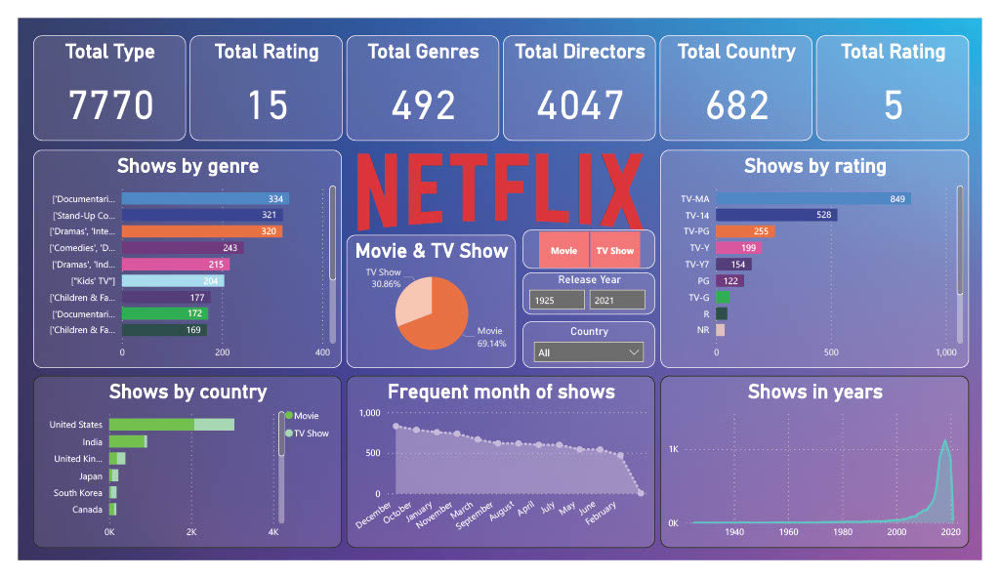

# 📊 Netflix Power BI Dashboard

This repository contains a Power BI report analyzing Netflix content data. The report provides detailed insights into trends, genres, countries, release dates, ratings, and more.

---



---

## 📁 Project Files

| File Name               | Description                                        |
|------------------------|----------------------------------------------------|
| `NetFlix.pbix`         | Power BI report file with complete dashboard       |
| `netflix_titles.csv`   | Original dataset in CSV format                     |
| `netflix_titles.xlsx`  | Dataset in Excel format                            |
| `Preview.jpg`          | Image preview of the Power BI dashboard            |

---

## 🔍 Key Features

- 🎬 Breakdown of TV Shows vs Movies
- 📅 Year-wise content trends
- 🌍 Top countries producing Netflix content
- 🎭 Genre distribution and content ratings
- ⏱️ Duration analysis of content
- 🧭 Interactive filters for deep exploration

---

## 🧾 Dataset Source

> Dataset originally from:  
> [Netflix Movies and TV Shows on Kaggle](https://www.kaggle.com/datasets/shivamb/netflix-shows)

---

## 🚀 How to Use

1. Clone the repository:
   ```bash
   git clone https://github.com/yourusername/netflix-powerbi-dashboard.git
   ```
2. Open `NetFlix.pbix` in [Power BI Desktop](https://powerbi.microsoft.com/desktop/)
3. Explore the visuals and interact with filters

---

## 🛠 Tools Used

- Power BI Desktop
- DAX (Data Analysis Expressions)
- Excel / CSV for data cleaning
- Power Query Editor

---

## 🙋‍♂️ About Me

**Md. Jahid Hassan**  
Data Analyst | Data Enthusiast  
📧 jahidhsanto@gmail.com  
🔗 [LinkedIn](https://linkedin.com/in/jahidhsanto) | [GitHub](https://github.com/jahidhsanto)

---

## 📄 License

This project is licensed under the MIT License — use it freely with attribution.
